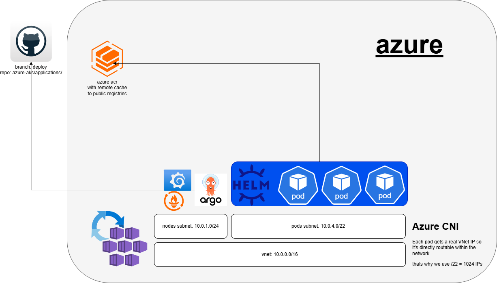

# azure-aks
By [artium-projects.com](https://artium-projects.com)


Production-grade AKS cluster managed with Terraform and ArgoCD. Built to demonstrate enterprise Kubernetes infrastructure patterns — networking, GitOps, container registry caching, OIDC authentication, and CI/CD — all fully reproducible and destroyable in minutes.

**What it creates:**
- AKS cluster with system + spot node pools, Azure CNI, and Azure AD RBAC
- ACR as a pull-through cache for container images (quay.io, ghcr.io, registry.k8s.io)
- ArgoCD for GitOps application delivery, bootstrapped by Terraform
- Prometheus + Grafana monitoring stack via ArgoCD
- Three GitHub Actions pipelines: infrastructure, application deployment, and destroy
- All authentication via OIDC — no stored credentials anywhere

## Prerequisites

- [Azure CLI](https://learn.microsoft.com/en-us/cli/azure/install-azure-cli)
- [gcloud CLI](https://cloud.google.com/sdk/docs/install) (for GCS state backend)
- [GitHub CLI](https://cli.github.com) (for setting secrets)
## Architecture




## Setup

Run the init script to create all prerequisites (Azure SP, GCP WIF, GitHub secrets). The script is idempotent — safe to re-run if a step fails.

```bash
# Interactive login, create prerequisites, output variables to .env
./init.sh

# Also set GitHub repo secrets
./init.sh --github
```

The script will:
1. Log you into Azure, GCP, and GitHub interactively
2. Create Azure AD app registration + OIDC federated credential
3. Create GCP Workload Identity Pool + OIDC Provider for GCS backend access
4. Generate `terraform/backend.conf` for the GCS state backend
5. Write all variables to `.env` (git-ignored)
6. (With `--github`) Show secrets for review, then set them on the repo via `gh secret set`

After setup, push to `main` — the pipelines handle everything:
- Push to `terraform/` → runs `terraform plan` + `apply`
- Push to `applications/` → renders `${ACR_REGISTRY}` placeholders and pushes to `deploy` branch

### GitHub Secrets

Set automatically by `init.sh --github`:

| Secret | Description |
|--------|-------------|
| `AZURE_CLIENT_ID` | App registration client ID |
| `AZURE_TENANT_ID` | Azure AD tenant ID |
| `AZURE_SUBSCRIPTION_ID` | Azure subscription ID |
| `GCP_WORKLOAD_IDENTITY_PROVIDER` | Full WIF provider path |
| `GCP_SERVICE_ACCOUNT` | Service account for GCS state backend |
| `GCS_BUCKET` | GCS bucket name for Terraform state |

All authentication uses OIDC — no stored keys or secrets.

### Workflow Permissions

Enable **"Read and write permissions"** under Settings > Actions > General > Workflow permissions, so the deploy-apps workflow can push to the `deploy` branch.

**Important:** The repo must be **public** — ArgoCD watches the `deploy` branch directly over HTTPS without credentials.

## Local Development

To run Terraform locally (e.g., to test a plan before pushing), you need a `terraform/backend.conf` file. The init script generates this automatically, or create it manually:

```
# GCS bucket for Terraform state (must already exist)
bucket = "your-gcs-bucket-name"
# Prefix (folder) inside the bucket
prefix = "azure-terraform"
```

Then:

```bash
cd terraform
terraform init -backend-config=backend.conf
terraform plan
```

All variables have sensible defaults in [`terraform/variables.tf`](terraform/variables.tf). To override values locally, copy the example file:

```bash
cp terraform.tfvars.example terraform.tfvars
```

Both `backend.conf` and `.tfvars` are git-ignored and never used by the pipeline.

## Access

After the pipeline deploys:

```bash
# Get kubeconfig
az aks get-credentials --resource-group azure-aks-rg --name azure-aks --admin

# ArgoCD UI
kubectl get svc -n argocd argocd-server -o jsonpath='{.status.loadBalancer.ingress[0].ip}'
```

ArgoCD admin password:

**Bash:**
```bash
kubectl -n argocd get secret argocd-initial-admin-secret -o jsonpath="{.data.password}" | base64 -d
```

**PowerShell:**
```powershell
$secret = kubectl -n argocd get secret argocd-initial-admin-secret -o jsonpath="{.data.password}"
[System.Text.Encoding]::UTF8.GetString([System.Convert]::FromBase64String($secret))
```

### Grafana

Grafana is deployed via the kube-prometheus-stack with pre-configured Kubernetes dashboards and Prometheus as a data source.

```bash
kubectl port-forward svc/kube-prometheus-stack-grafana 3000:80 -n monitoring
```

Open `http://localhost:3000` — login: `admin` / `prom-operator`.

## Node Pool Scheduling

The cluster has two node pools with different roles:

- **System pool** — stable, on-demand VMs for infrastructure (ArgoCD, Prometheus, Grafana, CoreDNS, etc.)
- **User pool** — cheap spot VMs (up to 90% savings) for application workloads, but Azure can reclaim them with 30 seconds notice

We use spot instances for the user pool to keep costs low for a personal/demo cluster. In production, you'd use on-demand VMs for application workloads to guarantee availability — spot evictions would cause downtime. Spot makes sense here because we're optimizing for cost, not uptime.

The user pool has a **taint** (`kubernetes.azure.com/scalesetpriority=spot:NoSchedule`) that blocks all pods by default. This prevents critical infrastructure pods from accidentally landing on spot nodes where they could be evicted at any time. To schedule application workloads on the spot pool, add a **toleration** (allows the pod onto spot nodes) and **node affinity** (prefers spot nodes over system):

```yaml
tolerations:
  - key: kubernetes.azure.com/scalesetpriority
    operator: Equal
    value: spot
    effect: NoSchedule
affinity:
  nodeAffinity:
    preferredDuringSchedulingIgnoredDuringExecution:
      - weight: 1
        preference:
          matchExpressions:
            - key: kubernetes.azure.com/scalesetpriority
              operator: In
              values:
                - spot
```

Without these, pods land on the system pool by default.

## Adding Applications

Create a new folder under `applications/` with your Kubernetes manifests. For container images, use `${ACR_REGISTRY}` as the registry prefix — the deploy pipeline replaces it with the real ACR login server.

Image reference format by source registry:

| Source | Image reference |
|--------|----------------|
| Docker Hub | `nginx:alpine` (pulled directly — Docker Hub cache rules require credentials) |
| Quay.io | `${ACR_REGISTRY}/quay.io/prometheus/prometheus:latest` |
| GitHub CR | `${ACR_REGISTRY}/ghcr.io/org/image:tag` |
| Kubernetes | `${ACR_REGISTRY}/registry.k8s.io/kube-state-metrics/kube-state-metrics:v2.10.0` |

Example — add `applications/my-app/deployment.yaml`:

```yaml
apiVersion: apps/v1
kind: Deployment
metadata:
  name: my-app
  namespace: my-app
spec:
  replicas: 1
  selector:
    matchLabels:
      app: my-app
  template:
    metadata:
      labels:
        app: my-app
    spec:
      containers:
        - name: my-app
          image: ${ACR_REGISTRY}/quay.io/prometheus/prometheus:latest
```

For Helm charts, create an ArgoCD Application manifest (see `applications/monitoring/kube-prometheus-stack.yaml` for a full example):

```yaml
apiVersion: argoproj.io/v1alpha1
kind: Application
metadata:
  name: my-chart
  namespace: argocd
spec:
  project: default
  source:
    repoURL: https://charts.example.com
    chart: my-chart
    targetRevision: 1.0.0
    helm:
      releaseName: my-chart
      values: |
        image:
          registry: ${ACR_REGISTRY}/docker.io
          repository: myorg/myimage
  destination:
    server: https://kubernetes.default.svc
    namespace: my-chart
  syncPolicy:
    automated:
      prune: true
      selfHeal: true
    syncOptions:
      - CreateNamespace=true
```

Push to `main` and the deploy pipeline renders the placeholders and pushes to the `deploy` branch, which ArgoCD watches.

## Teardown

Run the destroy pipeline from GitHub Actions: **Actions > Destroy Infrastructure > Run workflow**, type `destroy` to confirm.

Or locally:
```bash
cd terraform && terraform destroy
```

## Production Considerations

> This cluster is public for simplicity. In a real production environment you would:
> - Make the AKS cluster **private** and place it behind an **Azure Firewall**
> - Use a VPN or Azure Bastion to access the private API server
> - Use a **separate deploy repository** for rendered manifests
> - Split the Terraform pipeline into **plan on PR** (with comment) and **apply on merge** with approval gates
> - Set up a **CI pipeline to mirror Helm charts** into ACR as OCI artifacts, eliminating runtime dependency on public Helm repos
> - Store cluster admin credentials in **Key Vault** instead of relying on Terraform state
> - Add **Docker Hub credentials** via Key Vault + ACR credential set to cache all images through ACR

## Architecture

See [aks-terraform.md](aks-terraform.md) for full architecture and design decisions.
